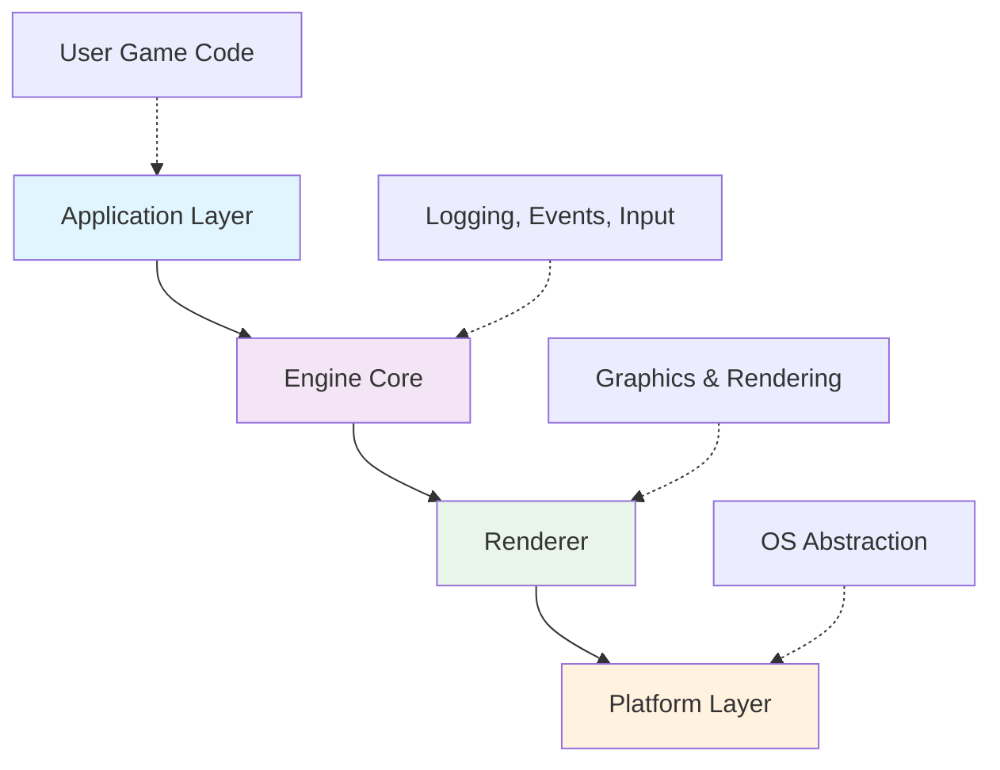

# IM3D Game Engine Documentation

## Overview

IM3D (Imagine3D) is a 3D game engine built in C++ with a focus on simplicity and performance. The engine is heavily inspired by the Hazel Engine and provides a solid foundation for creating 3D applications and games.

## Table of Contents

1. [Getting Started](#getting-started)
2. [Engine Architecture](#engine-architecture)
3. [Core Systems](#core-systems)
4. [Rendering System](#rendering-system)
5. [Window Management](#window-management)
6. [Building and Setup](#building-and-setup)
7. [API Reference](#api-reference)
8. [Examples](#examples)

## Getting Started

### Prerequisites

- CMake 3.10 or higher
- C++17 compatible compiler
- OpenGL support
- GLFW library
- Assimp library
- spdlog library

### Quick Start

1. Clone the repository
2. Build the engine using CMake
3. Create your application by inheriting from `IM3D::Application`

```cpp
#include "IM3D.h"

class MyGame : public IM3D::Application
{
public:
    MyGame() = default;
    ~MyGame() = default;
};

std::shared_ptr<IM3D::Application> IM3D::CreateApplication()
{
    return std::make_shared<MyGame>();
}
```

## Engine Architecture

### Core Design

The IM3D engine follows a layered architecture:



### Key Components

- **Application Layer**: Entry point and main game loop
- **Core Systems**: Logging, events, input, file handling
- **Renderer**: Graphics pipeline, shaders, models, textures
- **Window System**: Cross-platform window management
- **Platform Detection**: OS-specific code handling

## Core Systems

### Logging System

The engine uses spdlog for comprehensive logging capabilities.

```cpp
// Core engine logging
IM3D_LOG_CORE(IM3D_INFO, "Engine initialized successfully");

// Client application logging  
IM3D_LOG_CLIENT(IM3D_WARN, "Warning message: {}", warningText);
```

**Log Levels:**
- `IM3D_TRACE`: Detailed trace information
- `IM3D_DEBUG`: Debug information
- `IM3D_INFO`: General information
- `IM3D_WARN`: Warning messages
- `IM3D_ERR`: Error messages
- `IM3D_CTCL`: Critical errors

### Debug and Assertions

```cpp
// Debug break (Windows only currently)
IM3D_DEBUGBREAK();

// Assertions with custom messages
IM3D_ASSERT(condition, "Error message with parameter: {}", value);

// Simple assertions
IM3D_ASSERT_NO_MSG(condition);
```

### Input System

The engine provides a comprehensive input system for keyboard and mouse:

```cpp
// Keyboard input
enum class Key {
    Space = 32,
    A = 65, B = 66, C = 67,
    // ... full keyboard mapping
    F1 = 290, F2 = 291,
    // ... function keys
};

// Mouse input
enum class Mouse {
    ButtonLeft = 0,
    ButtonRight = 1,
    ButtonMiddle = 2,
    // ... additional mouse buttons
};
```

## Rendering System

### Core Renderer

The renderer supports OpenGL as the primary graphics API:

```cpp
// Initialize renderer
IM3D::Renderer::Init(); // Sets context to OpenGL
```

### Shader System

```cpp
// Create and use shaders
Shader shader("vertex_path.glsl", "fragment_path.glsl");
shader.use();

// Set uniforms
shader.setBool("enableLighting", true);
shader.setInt("texture1", 0);
shader.setFloat("time", deltaTime);
shader.setVec3("lightPos", lightPosition);
shader.setMat4("model", modelMatrix);
```

### Model Loading

The engine supports 3D model loading using Assimp:

```cpp
// Load a 3D model
Model myModel("path/to/model.obj");

// Render the model
myModel.draw(shader);
```

### Texture System

```cpp
// Load and bind textures
Texture texture;
unsigned int textureID = texture.load("path/to/texture.png", "directory", false);
```

### Primitive Rendering

```cpp
// Create and render primitives
std::vector<float> vertices = {/* vertex data */};
std::vector<unsigned int> indices = {/* index data */};

Primitive primitive(vertices, indices, GL_TRIANGLES);
primitive.render();
```

### Skybox Support

```cpp
// Create skybox
std::vector<std::string> faces = {
    "right.jpg", "left.jpg", "top.jpg",
    "bottom.jpg", "front.jpg", "back.jpg"
};

Skybox skybox(faces);
skybox.bind();
// ... render skybox
skybox.unbind();
```

### Camera System

```cpp
// Initialize camera
Camera camera;
camera.initialize(window);

// Update camera each frame
camera.update(deltaTime);

// Handle mouse look
camera.look(mouseX, mouseY);

// Use camera matrices
shader.setMat4("view", camera.view);
shader.setMat4("projection", camera.projection);
```

**Camera Controls:**
- WASD: Movement
- E/Q: Up/Down movement
- Mouse: Look around

## Window Management

### Window Creation

```cpp
// Create window with default options
auto window = IM3D::Window::Create();

// Create window with custom options
IM3D::WindowOptions options(1920, 1080, "My Game");
auto window = IM3D::Window::Create(options);
```

### Window Interface

```cpp
// Get window properties
uint32_t width = window->GetWidth();
uint32_t height = window->GetHeight();

// Enable/disable V-Sync
window->SetVsync(true);
bool vsyncEnabled = window->IsVsync();
```

### Window Options

```cpp
struct WindowOptions {
    uint32_t Width = 1920;
    uint32_t Height = 1080;
    std::string Title = "Imagine3D Application";
};
```

## Building and Setup

### CMake Configuration

The engine uses CMake for cross-platform building:

```cmake
# Engine build (IM3D/CMakeLists.txt)
cmake_minimum_required(VERSION 3.10)
project(IM3D)
set(CMAKE_CXX_STANDARD 17)

# Create shared library
add_library(IM3D SHARED ${SRC})

# Link required libraries
target_link_libraries(IM3D PRIVATE 
    opengl32 
    glfw3 
    assimp-vc143-mtd 
    spdlogd
)
```

### Client Application Setup

```cmake
# Application build (Sandbox/CMakeLists.txt)
cmake_minimum_required(VERSION 3.10)
project(Sandbox)

# Link against IM3D engine
target_link_libraries(Sandbox PRIVATE IM3D.lib)
target_compile_definitions(Sandbox PRIVATE IM3D_DYNAMIC_LINK)
```

### Required Definitions

```cpp
// For DLL usage
#define IM3D_DYNAMIC_LINK

// Platform detection (automatic)
#define IM3D_PLATFORM_WINDOWS  // On Windows
```

## API Reference

### Application Class

```cpp
class Application {
public:
    Application();
    virtual ~Application();
    
    void Init() const;    // Initialize engine systems
    void Run() const;     // Start main loop
};

// Client must implement
std::shared_ptr<Application> CreateApplication();
```

### Entry Point

The engine provides an automatic entry point:

```cpp
// Automatically defined for Windows
int main(int argc, char** argv) {
    auto app = IM3D::CreateApplication();
    app->Init();
    app->Run();
    return 0;
}
```

### Platform Detection

```cpp
#ifdef IM3D_PLATFORM_WINDOWS
    // Windows-specific code
    #define IM3D_DEBUGBREAK() __debugbreak()
#else
    #error "Platform doesn't support debugbreak yet!"
#endif
```

## Examples

### Basic Application

```cpp
#include "IM3D.h"

class MyApp : public IM3D::Application {
public:
    MyApp() {
        IM3D_LOG_CLIENT(IM3D_INFO, "Application created");
    }
    
    ~MyApp() {
        IM3D_LOG_CLIENT(IM3D_INFO, "Application destroyed");
    }
};

std::shared_ptr<IM3D::Application> IM3D::CreateApplication() {
    return std::make_shared<MyApp>();
}
```

### Rendering Example

```cpp
class RenderApp : public IM3D::Application {
private:
    Shader shader;
    Model model;
    Camera camera;
    
public:
    void Initialize() {
        // Load resources
        shader = Shader("vertex.glsl", "fragment.glsl");
        model = Model("assets/model.obj");
        camera.initialize(window);
    }
    
    void Update(float deltaTime) {
        camera.update(deltaTime);
        
        // Render
        shader.use();
        shader.setMat4("view", camera.view);
        shader.setMat4("projection", camera.projection);
        
        model.draw(shader);
    }
};
```

## File Structure

```
IM3D/
├── src/
│   ├── IM3D/
│   │   ├── Core/           # Core engine systems
│   │   ├── Renderer/       # Graphics and rendering
│   │   └── Window/         # Window management
│   └── IM3Dpch.h          # Precompiled header
├── vendor/
│   ├── include/           # Third-party headers
│   └── lib/              # Third-party libraries
└── CMakeLists.txt        # Build configuration

Sandbox/                  # Example application
├── src/
│   └── Sandbox.cpp       # Application implementation
└── CMakeLists.txt        # Application build config
```

## Contributing

The IM3D engine is open for contributions. When adding new features:

1. Follow the existing code style
2. Add appropriate logging
3. Update documentation
4. Test on target platforms

## License

This project is licensed under the GNU General Public License v3.0. See the LICENSE file for details.

## Acknowledgments

- Inspired by the Hazel Engine
- Uses GLFW for window management
- Uses Assimp for 3D model loading
- Uses spdlog for logging
- Uses stb_image for image loading
